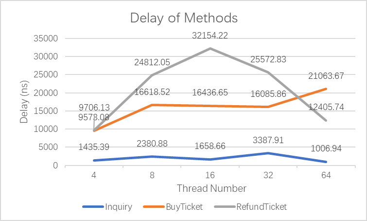
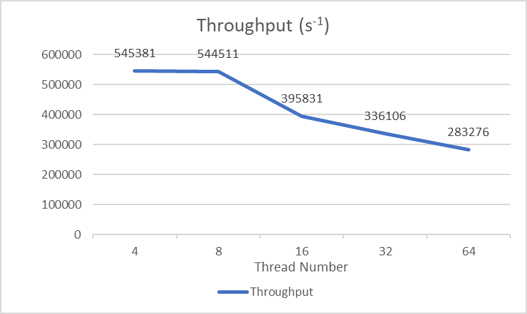
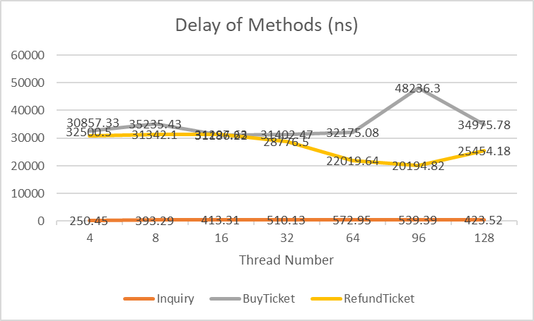
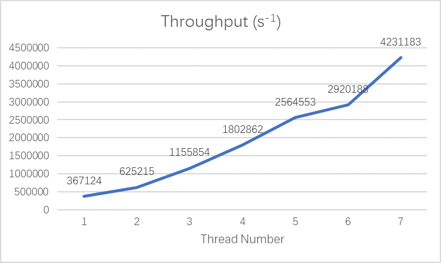
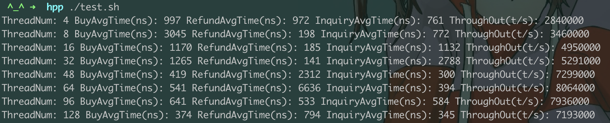
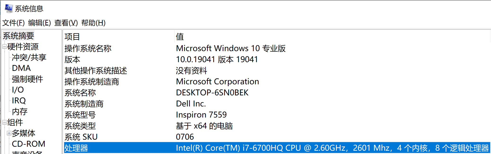
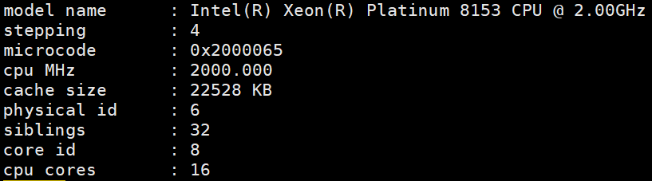

## 售票系统性能评测报告

**《并发数据结构与多核编程》大作业**

**姓名：林嘉玮，学号：202028001027016，班级：9305**

[TOC]

### 一、实现思路：

​	被多个线程读写的变量都需要并发控制，因此主要的并发数据分为两类，一是记录每个座位被占用情况的**座位变量**。购票函数需要确认该变量表示的座位占用情况可以满足购票的乘车区间，并改写该变量。退票函数需要改写该变量，将其占用的座位复原成未被占用。二是记录已售车票的**车票表**，用于确认退票函数给出的票是否存在，它可以是数组、链表、哈希表等可以将任意元素插入、删除的资源池。其中，定义**乘车区间**为：出发站 、到达站的二元组合 `(departrue, arrival)` 。

#### 1. 车票表

​	车票表用于保存已售车票对象，在购票时加入数据，退票时查找并删除数据。大部分课程内学过的并发数据结构都可以用于实现车票表。一般选择性能较高的数据结构可选的方案，包括**原子引用数组、无锁链表、并发开放哈希**。其中原子引用数组 `AtomicReferenceArray` 可以通过设置足够多的数组进行冗余存储，类似于哈希表构造映射函数可以直接访存。在本例中可以对每个座位节点设置长度为 `stationnum` 的数组，用车票的出发站 `ticket.departure` 作为索引。

​	本次实现将三种方法都尝试了，其中的 `hopscotch` 哈希表在删除元素时存在错误，这是由于多次跳格子将某些原有元素跳离检测区间 `HOP_RANGE` 导致的。和吴鹏老师在课后问过这个问题，当时没明白，现在也没时间修复此错误。由于作业要求对空间复杂度没有要求，因此选择时间复杂度低 O(1) **冗余存储**方法来存储车票数据。需要注意的是，不管选择怎样的数据结构实现车票表，由于车票对象是实时生成的，因此如果只存储车票对象的引用，对车票访问的**缓存缺失**不可避免。在实现哈希表时需要在车票表中预定义车票数据缓解缓存缺失。其次，吕毅老师提到会**伪造车票**数据，以检验退票方法的正确性。如果购票返回的车票对象直接存储在哈希表中，对车票的改变也会直接改变哈希表中的数据。因此购票函数在存储数据时，需要复制构造该车票对象，或者使用数据预定义的哈希，以解决伪造车票。

#### 2. 座位变量：位运算

​	位运算将共享资源定义成一张记录每个座位预定情况的表。为每个车次记录一张**座位表**，则表的总数为`routenum`；每张表记录所有的座位，则表的长度为`coachnum*seatnum`；表中描述每个座位的元素定义成节点 **Node** ，每个节点包括了一个64比特位宽的原子长整型变量 `AtomicLong` ，称之为比特串 **B** ，比特串的每个比特位表示该座位在不同车站间被预定的情况。**购票函数**通过位运算找到存在余票的座位节点，用 CAS 原语成功更改其比特串后，生成一张票返回。并在座位表中增加该票。**退票函数**在车票表中尝试退票，成功后直接找到其对应的座位节点，用 CAS 原语更改比特串 B 。**查询函数**遍历车次表，返回余座总数。

#### 3. 座位变量：区间链表

​	区间链表将一列车次所有座位编序，将某段连续的、未被预定的座位序号用节点表示，节点可以理解成区间二元组，区间链表可以用来描述所有座位在不同乘车区间的预定情况。对于 `stationnum = L` 个车站，每个乘车区间都定义一个区间链表，表的数目是 `L*(L-1)/2` 。例如乘车区间 `(departrue = 1, arrival = 2)` 是该车次的第一张表 `List[0]` ，初始化为 `List[0] = {(0,N)}` ，其中 N 是该车次的座位总数 `coachnum*seatnum = N` 。当某线程购买了该区间第k个座位的车票，那么它变成 `List[0] = {(0,k-1)->(k+1,N)}` 。对某段乘车区间，即某张区间链表，某个没有预定的坐席 k ，则 k 会出现在链表中某个节点表示的区间内。定义某段乘车区间相交叠的其它区间称为**相关区间**。**查询函数**通过统计该链表所有节点表示的区间长度之和得到结果。**购票函数**找到某座位后将其序号从链表中剔除，另外还需要将相关区间的所有链表中相应坐席剔除。**退票函数**将该票座位序号插入到其区间链表及其相关区间的所有链表中。

​	这种方法看似简单，但它是**不可行**的，原因在于它表示的信息不完整。当退票函数要增加其它相关区间表中的序号时，不能确定它是由于交叠占用还是已被购票才消失的，因此需要借助车票表确认该需要是否需要加入链表。这是一种时间复杂度和空间复杂度较为平衡的方法，但作业只需考虑时间复杂度，因此这种思路不去实现。但是它引出了一种减少查询函数时间复杂度的方法，在以下会做介绍。

#### 4. 查询函数

​	之所以特别关注查询函数，是因为其调用比例最大，缺省为 60% 。而且简单的查询思路是对所有座位变量做扫描，即便是线性时间复杂度 O(n) 也会耗费大量时间，这种方法称为**扫描查询**。

​	从区间链表的思路出发，可以对每个乘车区间实时地维护余票数量。即购票时将余票数减一，退票时将余票数加一，并对所有相关区间的余票数做相同操作。从而将查询函数的时间复杂度转嫁到购票函数和退票函数，查询函数只需读一次原子寄存器，其时间复杂度降至常数 O(1) 。这种方法称为**余票维护**。为此定义一个原子整型变量数组 `AtomicIntegerArray[length]` ，称为**余票表**，其长度为区间总数 `length = L*(L-1)/2 ` ，其中 L 为车站数目。其**优点**在于查询方法在实现上得到最大程度的简化。**缺点**在于：1. 增加了购票、退票方法的复杂度，约为 O(L^2^) ；2. 对余票表的读操作频繁，线程争用极高。

​	针对余票表争用的优化，尝试几个方法：1. **数据类型**：使用 `LongAdder` 数组替代 `AtomicIntegerArray`，前者的增加 `increment()` 、减少 `decrement()` 方法仅有写操作，不会访问共享内存。后者的 `incrementAndGet()` 方法每次写都需要访问 CPU 之间的共享内存，因此延时更长。但经对比之后优化后结果差别不大。2. **抵消数组**：在学习共享栈时提到了对单一对象增加并发度的抵消思想，在此例中的余票表也适用。具体实现是构建抵消数组增加线程所争用对象的数量，对匹配的增加、减少操作相抵消，免去了对余票表的访问。这是一个很酷的改进方法，但是经对比之后优化后结果差别不大。也可能代码在服务器上运行时间波动太大。

### 二、分析测试

#### 1. 可线性化

​	对于座位变量，其实现使用原子长整型变量，各方法调用都使用原语进行互斥访问。因此只要顺序实现的逻辑是正确的，就能在并发实现上满足线性一致性。而车票表是并发哈希表，使用可重入锁进行互斥访问。因此实现是**可线性化 Linearizability** 的。可线性化的验证使用吕毅老师提供的单线程线性化验证程序，及其它同学提供的线性化验证工具。

​	同学们在课程群聊中深入讨论了查询方法的可线性化。得益于余票表的实现机制，本实现避开了可线性化的细节困难。但有必要详细地讨论可线性化性。首先，明确可线性化概念涉及到的定义。**可线性化的定义**是：各方法的执行历史可以抽象出对并发系统状态改变的一个顺序历史。只考虑方法调用之间的时序和返回结果是不周全的，在此需要明确三个**系统状态**：座位变量、车票表和余票表。为了三个方法在编程实现上的便利引入了这三种系统状态，它们描述的是同一事物（列车上的售票情况）在不同方面的信息。

​	其次，可线性化是执行相关的，需要区分不同的资源**竞争条件**。**购票与购票**竞争时，可线性化点是对座位变量的 CAS 操作。即哪个线程先成功地用 CAS 占据了该座位，它对该座位购票成功。**退票与退票**竞争时，同时对车票表调用 `remove()` 方法，该函数用可重入锁互斥，可线性化点是锁的申请。**购票与退票**竞争时，可线性化点是车票表 `add()` 和 `remove()` 方法中锁的申请和释放。**查询与其它**的可线性化点是对余票表的 `intValue()` 、 `increment()` 和 `decrement()` 原语。即查询调用原语 `intValue()` 的时刻，购票函数尚未调用 `decrement()` 则仍计入该票，退票函数尚未 `increment()` 则不计入该票。分析了竞争条件和系统状态，便可以清楚地理解并发系统的各方法的逻辑关系。

​	最后，由于本实现将同一事物（列车上的售票情况）在不同方面的信息分成三个并发数据结构（座位变量、车票表和余票表），因此它本质上可以做到顺序一致性。只要在各方法的实现上对此三者的读写顺序保持合法的次序，就可以实现可线性化性。即购票方法先修改座位变量，退票时先在车票表中删除元素，其它二者顺序任意。

#### 2. 并发性质

​	并发性质描述的是方法的进展性。座位变量使用原语进行互斥，虽然造成大量争用、性能下降，但并发性质良好。车票表是并发开放哈希，其方法在获得锁的情况下是完全的，使用的可重入锁互斥会引起线程阻塞挂起。由于购票函数和退票函数都需要读写哈希表，因此都不是无锁的。**与锁相关的并发性质**只取决于哈希表的方法实现，因此购票和退票方法是无死锁但不是无饥饿的。方法的**进展性**由具体实现来决定，购票、退票方法都使用了条件循环 `while()` ，因此不是无等待的。查询函数不使用锁，因此不考虑锁的性质，且它只读不写，使用原子语句实现了无等待。

| 车票表：并发开放哈希       | 查票 | 购票 | 退票 |
| -------------------------- | ---- | ---- | ---- |
| **无死锁 deadlock-free**   | ◯    | ✔    | ✔    |
| **无饥饿 starvation-free** | ◯    | ✘    | ✘    |
| **无锁 lock-free**         | ✔    | ✘    | ✘    |
| **无等待 wait-free**       | ✔    | ✘    | ✘    |

​	如果车票表使用**冗余存储**来实现，就实现了无锁的售票系统。与锁相关的进展性不必考虑，用 ◯ 表示。各方法实现是非阻塞的，因此是无锁的。由于座位变量需要用 `while` 循环重复访问，仍不能实现无等待，这一点是作业要求 “若有余票，则不能不卖” 带来的。

| 车票表：冗余存储           | 查票 | 购票 | 退票 |
| -------------------------- | ---- | ---- | ---- |
| **无死锁 deadlock-free**   | ◯    | ◯    | ◯    |
| **无饥饿 starvation-free** | ◯    | ◯    | ◯    |
| **无锁 lock-free**         | ✔    | ✔    | ✔    |
| **无等待 wait-free**       | ✔    | ✘    | ✘    |

#### 3. 性能测试

​	利用性能测试代码 Test.java 得到不同并发线程数量时的各方法调用延时和吞吐率。**默认参数**是：每个线程工作量固定为 10000 次方法调用，按 60%、30%、10% 的比例分别调用查询、购票、退票函数。**参数设置**如下：

```java
static int threadnum = 64;
static int routenum = 20;
static int coachnum = 10;
static int seatnum = 100;
static int stationnum = 16;
```

##### 本机测试记录

```sh
线程数		查询 (ns)		购票 (ns)			退票 (ns)			吞吐率
# 用抵消数组
4       102.19ns        8845.11ns       8131.59ns       1080975
8       369.54ns        15618.66ns      14160.17ns      1249333
16      287.38ns        24173.24ns      16389.25ns      1533542
32      1082.47ns       32099.81ns      23169.86ns      2056748
64      1482.25ns       89848.22ns      41173.22ns      1158507
# 没用抵消数组
4       117.97ns        2768.63ns       2042.98ns       2667141
8       208.46ns        9416.59ns       5013.32ns       1792877
16      369.51ns        8391.79ns       3154.13ns       1977046
32      387.40ns        12013.37ns      3246.58ns       2838177
64      767.69ns        42156.11ns      4488.87ns       2730790
```

| 延时| 吞吐率|
| --- | --- |
|  |  |

##### 服务器测试记录

```sh
线程数		查询 (ns)		购票 (ns)		退票 (ns)		吞吐率
# 用了抵消数组还不如不用。
4       250.45ns        32500.50ns      30857.33ns      367124
8       393.29ns        35235.43ns      31342.10ns      625215
16      413.31ns        31186.22ns      31297.63ns      1155854
32      510.13ns        31402.47ns      28776.50ns      1802862
64      572.95ns        32175.08ns      22019.64ns      2564553
96      539.39ns        48236.30ns      20194.82ns      2920188
128     423.52ns        34975.78ns      25454.18ns      4231183
# 没用抵消数组只有在128线程时性能下降。
4       210.45ns        8551.98ns       9496.66ns       839689
8       394.98ns        11833.05ns      11575.02ns      979563
16      400.79ns        8071.08ns       7334.02ns       2053607
32      535.33ns        14454.59ns      6597.69ns       2163043
64      340.63ns        19684.36ns      5078.34ns       2979012
96      426.50ns        21280.12ns      6486.38ns       3505713
128     313.54ns        732715.42ns     5979.43ns       194074[
```

| 延时| 吞吐率|
| --- | --- |
|  |  |

##### 参考同学的性能：



​	延时上相差两个数量级！针对线程争用问题，可以使用共享计数或其它方法降低争用。但没时间写了，我要复习。

##### 最后评分

|          | FakeRefund | Linearizable | Performance | ErrorofRefund | 性能分 | 总评分 |
| -------- | ---------- | ------------ | ----------- | ------------- | ------ | ------ |
| 冗余存储 | 1          | 0            | 15920/ms    | 0             | 100    | 98     |
| 无锁链表 | 0          | 0            | 1336/ms     | 1             | 75     | 75     |


### 附录一：关键源码

#### 1. 查询

```java
// 简单的思路：扫描查询
public int inquiry(int route, int departure, int arrival) {
    int rtn = 0, i = route - 1;
    long a = INI >> (departure - 1);
    long b = INI >> (arrival - 1);
    long c = a ^ b;
    for (int j = 0; j < this.TrainSeatNum; j++) {
        long d = L[i].nd_lst[j].f_get();
        if ((d & c) == 0) {
            rtn++;
        }
    }
    return rtn;
}
// 改进：余票维护
public int inquiry(int route, int departure, int arrival) {
    int k = Node.f_cvt_idx(departure, arrival, this.stationnum);
    int rtn1 = L[route - 1].f_get_tkt_left(k);
    return rtn1;
}
```

#### 2. 购票

```java
// For inquiry() simplify!
int[] mark = this.nd_lst[i].f_get_mark(ticket.departure, ticket.arrival);
this.f_decrement(ticket.departure, ticket.arrival, mark);
```

#### 3. 退票

```java
// For inquiry() simplify!
int[] mark = this.nd_lst[idx].f_get_mark(ticket.departure, ticket.arrival);
this.f_increment(ticket.departure, ticket.arrival, mark);
```


### 附录二：测试记录

#### 1. 测试环境

​	在本机上的测试环境是：处理器为 intel i7 四核8线程，工作频率2.6GHz，内存RAM大小8GB。



​	在服务器上的测试环境是：处理器芯片是Intel Xeon(R) Platinum 8153 十六核32超线程，有八个CPU芯片。因此共有128物理核，256超线程。保守地认为服务器支持128个线程满负载并发。

```
model name 	: Intel(R) Xeon(R) Platinum 8153 CPU @ 2.00GHz
stepping 	: 4
microcode	: 0x2000065
cpu MHz		: 2000.000
cache size	: 22528 KB
physical id	: 6
siblings 	: 32
core id 	: 8
cpu cores	: 16
```




#### 2. 测试方法

​	本机测试直接在 VScode 编辑器运行。也可以使用Windows 10命令行。步骤包括：编译、生成记录、运行测试脚本、运行线性化验证脚本。

```sh
ThreadId TicketBought tid passenger route coach departure arrival seat
```

##### 	本机运行线性化验证脚本：

```sh
e:
cd E:\Program_Files\JavaCode\myproject
javac -encoding UTF-8 -cp . ticketingsystem/Trace.java
java -cp . ticketingsystem/Trace > ./ticketingsystem/verify/trace
cd  ./ticketingsystem/verify/
java -jar verify.jar trace
cd ..
del *.class
cd ..

```

##### 	本机运行性能测试脚本：

```sh
e:
cd E:\Program_Files\JavaCode\myproject
javac -encoding UTF-8 -cp . ticketingsystem/Test.java
java -cp . ticketingsystem/Test --threadnum 4
java -cp . ticketingsystem/Test --threadnum 8
java -cp . ticketingsystem/Test --threadnum 16
java -cp . ticketingsystem/Test --threadnum 32
java -cp . ticketingsystem/Test --threadnum 64

```

##### 	服务器运行性能测试脚本：

​	服务器测试需要在PSFTP传输文件：

```sh
# SSH登入124.16.138.31。用户名：user019，初始密码：user019xyz
# 使用Putty PSFTP工具传输代码文件：
open MCP
user019
linjw16
put -r E:\Program_Files\JavaCode\myproject /pub/home/user018/myproject

```

​	在PuTTY工具运行性能测试脚本：

```sh
cd ./myproject/
javac -encoding UTF-8 -cp . ticketingsystem/Test.java
java -cp . ticketingsystem/Test --threadnum 4
java -cp . ticketingsystem/Test --threadnum 8
java -cp . ticketingsystem/Test --threadnum 16
java -cp . ticketingsystem/Test --threadnum 32
java -cp . ticketingsystem/Test --threadnum 64
java -cp . ticketingsystem/Test --threadnum 96
java -cp . ticketingsystem/Test --threadnum 128

java -cp . ticketingsystem/Test --threadnum 128 --routenum 100 --coachnum 50 --seatnum 100 --stationnum 50 --testnum 100000

```

# github-upload
